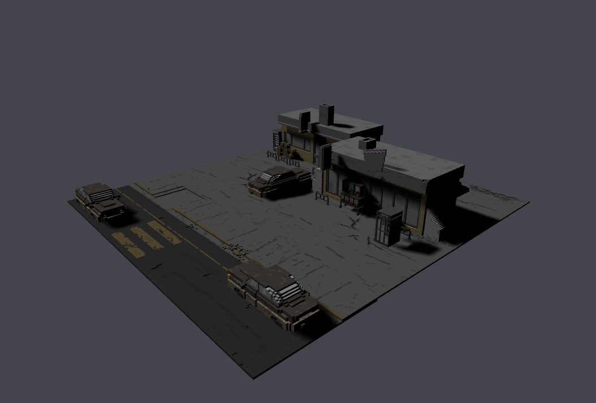

# 🌫️ Soft Shadows in WebGL

This project demonstrates the implementation of soft shadows using WebGL, focusing on real-time rendering techniques to improve visual realism.
The core technique explored is Percentage-Closer Filtering (PCF), commonly used to smooth shadow edges in shadow mapping.

# 🌍 Live Demo
https://joaovfarias.github.io/SoftShadowsWebGL/

# 🛠️ Tech Stack
- Graphics API: WebGL
- Language: JavaScript
- Shaders: GLSL
- Rendering Technique: Shadow Mapping with PCF

# 

